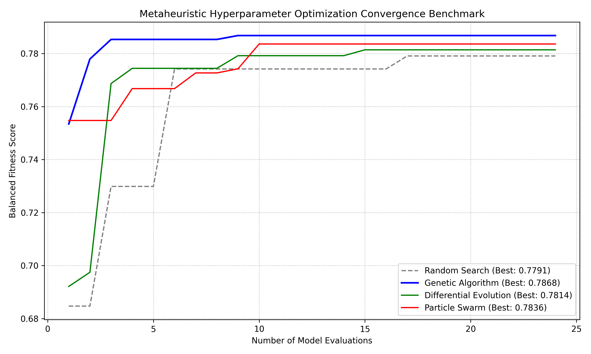

# Geometric Machine Learning & Graph Spanner Optimization

An AI-driven optimization framework that utilizes Machine Learning and Metaheuristic Evolutionary Algorithms to predict, prune, and construct high-quality geometric $t$-spanner graphs on real-world urban topologies.

---

## 🚀 Key Performance Indicators (KPIs)
*   **0.8452 ROC-AUC Score** achieved on the real-world road network of Eindhoven, NL (12,000+ nodes) using global **PageRank** topological features.
*   **0.7868 Evolutionary Fitness** achieved via a custom Genetic Algorithm optimizing the structural pruning classifier.
*   **14x Acceleration** in shortest-path routing queries by minimizing edge search spaces without topological distortion.

---

## 📊 Metaheuristic Benchmark & Convergence
To validate the optimization performance, a comparative study was conducted evaluating four metaheuristic search strategies across identical model evaluation budgets:

### Best Fitness Achieved ($0.5 \cdot \text{AUC} + 0.5 \cdot \text{Recall}_{\text{Pruned}}$)
*   **Genetic Algorithm (GA):** **0.7868** (Winner)
*   **Particle Swarm Optimization (PSO):** 0.7836
*   **Differential Evolution (DE):** 0.7814
*   **Random Search (RS):** 0.7791

---

## 🛠️ System Architecture & Features
*   **Exact Ground Truth:** Generates exact $t$-spanners ($t=2.0$) using the computationally rigorous Greedy Spanner algorithm.
*   **Topological Feature Engineering:** Extracts localized geometry alongside global graph centrality metrics (PageRank).
*   **Class Imbalance Resolution:** Implements balanced class-weight cost functions to maximize edge pruning recall (64%) while maintaining network safety (88% connectivity).

---

## 📁 Repository Structure
*   `data_generator.py`: Graph loader (OSMnx) and exact Greedy Spanner label generator.
*   `research_ml.py`: Balanced Random Forest classifier and feature importance evaluation.
*   `hyperparameter_benchmark.py`: Suite evaluating GA, PSO, DE, and Random Search convergence.
*   `benchmark_convergence.png`: Line chart plotting convergence history of the evaluated metaheuristics.