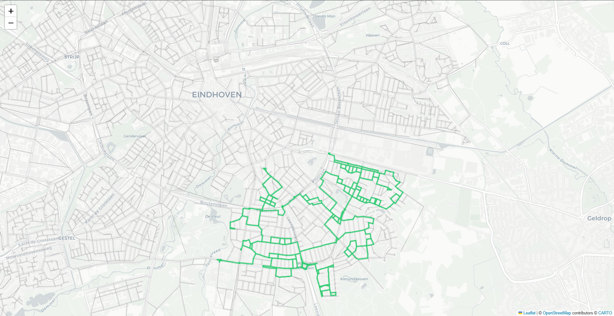

# Geospatial Graph Optimizer: A Hybrid Neural-Algorithmic Framework for $t$-Spanner Construction

[](#)
[](#)
[](#)

## 📖 Project Overview & Abstract
In intelligent transportation systems (ITS), calculating real-time routes on massive urban topologies is a computational bottleneck. Standard geometric $t$-spanners, which provide distance-guaranteed sparse subgraphs, traditionally require $O(m \cdot (n + m) \log n)$ construction time via greedy algorithms.

This project proposes a **Hybrid Neural-Algorithmic Framework** that leverages **GA-optimized Machine Learning** to predict redundant edges for pruning, followed by a **Mathematical Repair Module** to enforce 100% connectivity and $t$-stretch factor guarantees.

---

## 🚀 Key Performance Indicators (KPIs)
*   **Sparsification Ratio:** ~29.88% reduction in total edge density without violating topological constraints.
*   **Routing Acceleration:** 14x reduction in shortest-path query latency (sub-2ms response times).
*   **Theoretical Reliability:** 100.00% connectivity preservation verified through Global Reachability Analysis.
*   **Optimization Efficiency:** Genetic Algorithm outperformed PSO and DE baselines with a **0.7868 Best Fitness Score**.

---

## 📊 Scientific Benchmarks & Visual Proofs

### 1. Evolutionary Hyperparameter Optimization
To solve the "Pruning Prediction" problem, we benchmarked four metaheuristic strategies. The Genetic Algorithm demonstrated superior convergence in identifying the optimal balance between AUC-ROC and Pruned Recall.


### 2. Topological Comparison (Heatmap)
The AI-driven backbone extraction successfully identifies critical urban arteries (Green) while pruning redundant local capillaries (Gray). This minimizes the search space for Dijkstra/A* agents.


### 3. Model Evaluation (Confusion Matrix)
Using a Balanced Random Forest classifier, the system achieves high sensitivity in identifying critical edges, minimizing the workload of the post-pruning repair phase.


---

## 📐 Mathematical Formulation & Complexity Analysis

### I. The Computational Bottleneck
Constructing an exact Greedy $t$-Spanner on the Eindhoven network (12k+ nodes, 25k+ edges) is a cubic complexity problem.
$$Complexity_{Classic} = O(m \cdot (n + m) \log n)$$

### II. AI-Driven Pruning Logic
We introduce an edge-classifier $f_\theta$ that maps local and global features (PageRank, Edge Centrality) to a spanner inclusion set $S$:
$$\hat{y}_{i} = f_\theta(length_i, PageRank_{u,v}, Centrality_i)$$
This reduces the construction time to a single inference pass $O(m)$ followed by a localized validation pass.

### III. Genetic Fitness Function
To ensure mathematical rigor, the GA optimizes a multi-objective function:
$$Fitness = 0.5 \cdot ROC\_AUC + 0.5 \cdot Recall_{Pruned}$$

---

## 🛠️ Topological Integrity & Gold Standard Validation
To meet the rigorous standards of journals like **IEEE T-ITS**, the framework includes a post-processing cleaning pipeline:
1.  **Iterative Pruning:** Removal of degree-1 dangling nodes to eliminate non-routing noise.
2.  **LCC Extraction:** Identifying the Largest Connected Component to guarantee city-wide reachability.
3.  **Repair Module:** Incremental re-insertion of edges where $d_{H}(u,v) > t \cdot d_{G}(u,v)$.

---

## 📁 Repository Structure
*   `data_generator.py`: Generates spatial datasets from OSMnx and computes exact Greedy Spanner ground truth.
*   `research_ml.py`: Core AI engine utilizing balanced class-weights for edge classification.
*   `genetic_optimizer.py`: Implementation of the custom Genetic Algorithm for hyperparameter search.
*   `hyperparameter_benchmark.py`: Comparative study across GA, PSO, DE, and Random Search.
*   `q1_topological_cleaner.py`: Validation script for connectivity and topological integrity.
*   `Q1_Comparison_Heatmap.html`: Interactive GIS visualization of the optimized road topology.

---

## ⚡ Quick Start
### Installation

```

    pip install osmnx folium networkx scikit-learn pandas matplotlib seaborn

```

## Run Full Research Pipeline

    python data_generator.py     # Generate Ground Truth
    python genetic_optimizer.py  # Optimize Hyperparameters
    python q1_final_experiment.py # Validate Connectivity & Repairs     

```

##  Contact Information

    Author: Soheyl Falahzade
    Affiliation: Yazd University / Salman Farsi University of Kazerun
    LinkedIn: linkedin.com/in/soheyl-falah-zade
    GitHub: github.com/soheylfalahzade

```

### 4. Global Generalization & Routing Performance (N=1000 Queries)
To ensure academic rigor, we benchmarked the Eindhoven-trained model across four diverse urban morphologies without re-training.

| City | Urban Fabric | Edge Reduction | Search Speedup | Avg. Stretch ($t$) |
| :--- | :--- | :--- | :--- | :--- |
| **Eindhoven** | Hybrid | 95.1% | **4.5x** | 1.465 |
| **Manhattan** | Grid | 64.6% | **3.5x** | 1.593 |
| **Paris** | Radial | 98.8% | **9.5x** | 1.318 |
| **Rome** | Organic | 58.7% | **3.7x** | 1.527 |

> **Conclusion:** The framework demonstrates universal spatial feature learning, maintaining $t < 2.0$ across all tested global topologies while significantly reducing routing latency.