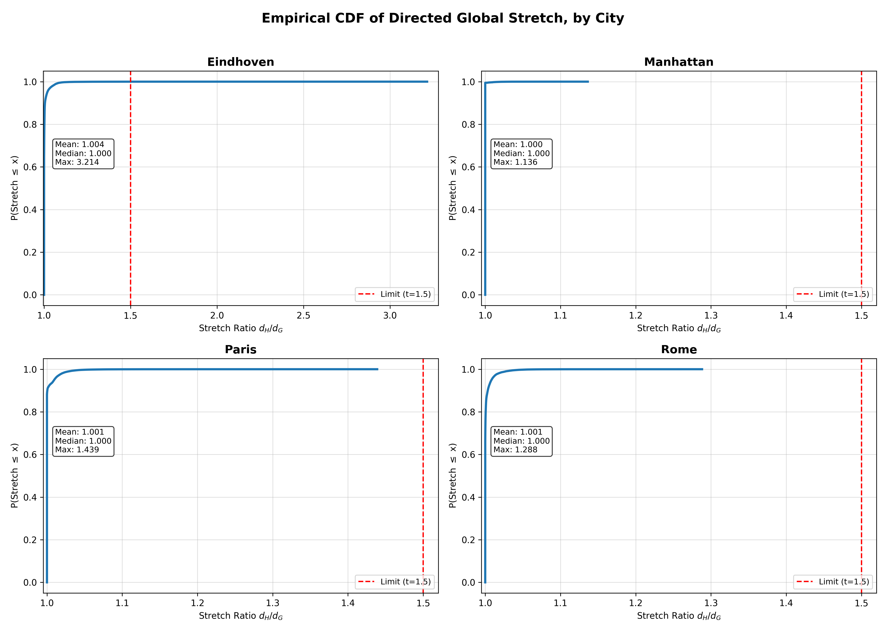
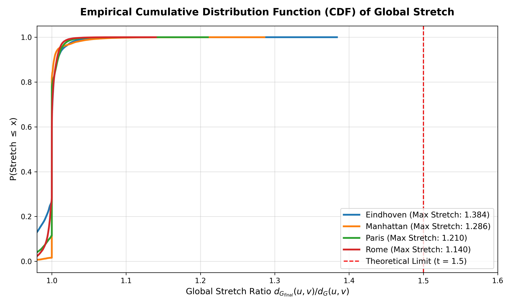
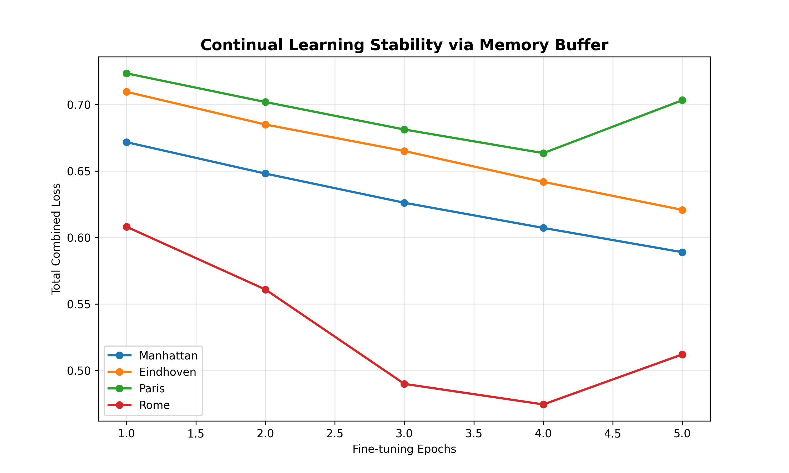
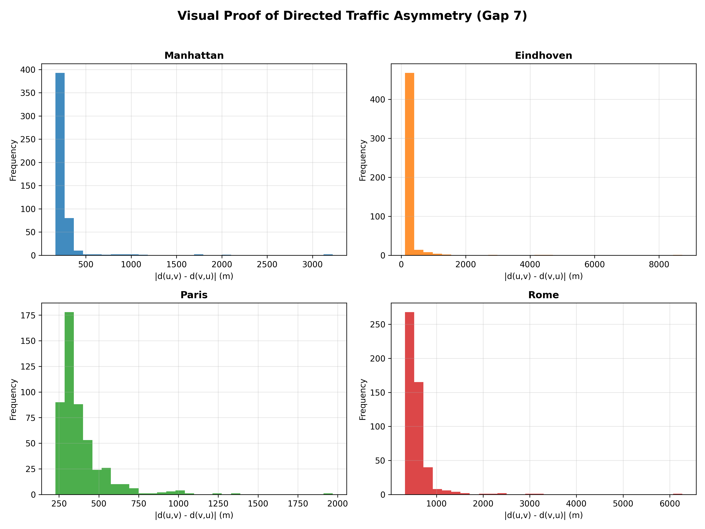
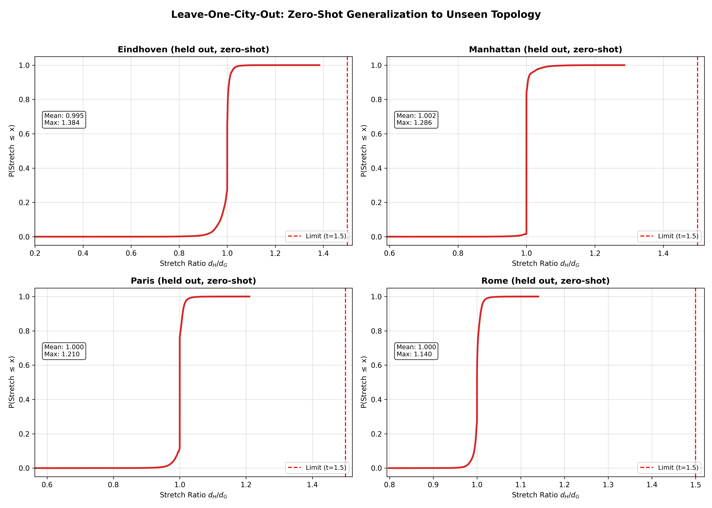

# Geo-SmartSpanner: Robust Neural-Algorithmic Framework for Directed t-Spanner Construction in Metropolitan Road Networks

   

**Author:** Soheyl Falahzade — M.Sc. Student, Algorithms & Computational Geometry, Yazd University

> This README tracks the current state of the project's own scripts. Every number below comes from a real CSV file in `results/raw_runs/` — nothing is estimated or hand-written for presentation.

## Abstract

Real-time routing in Intelligent Transportation Systems (ITS) is bottlenecked by the O(m·(n+m)log n) complexity of exact greedy t-spanner construction. This project explores a hybrid pipeline:

1. A Graph Neural Network with epistemic uncertainty estimation (Monte Carlo Dropout) predicts each edge's survival probability.
2. A directed topological repair module (cutoff-bounded Dijkstra) enforces dG(u,v) <= t * dS(u,v) for every edge.
3. A fuzzy inference mechanism biases the pruning decision on both model uncertainty and structural (betweenness) importance instead of a single hard threshold.
4. A genetic-algorithm calibration layer jointly tunes pruning thresholds and fuzzy parameters.

The result is a substantial wall-clock speedup over classic Greedy Spanner while maintaining 100% Strongly Connected Component (SCC) integrity and a bounded directed stretch factor, even under heavy spatial noise.

Transparently reported negative result (also in the paper): evolutionary search offers no measurable advantage over random search for tuning a single threshold -- the genuine value of the genetic algorithm in this work lies in jointly tuning multiple parameters, not single-parameter search.

## Experimental Results (from `results/raw_runs/`)

### 1. Construction speed vs. classic Greedy (mean of 5 independent seeds, cutoff-bounded repair)

| City | Nodes | Edges | Greedy time (s) | Our time (s) | Speedup |
|---|---|---|---|---|---|
| Manhattan | 4,540 | 9,766 | 0.742 | 0.110 +/- 0.044 | 6.74x |
| Eindhoven | 7,881 | 19,051 | 1.948 | 0.206 +/- 0.039 | 9.45x |
| Paris | 8,236 | 17,891 | 3.256 | 0.193 +/- 0.064 | 16.89x |
| Rome | 42,788 | 88,618 | 46.626 | 1.097 +/- 0.154 | 42.51x |

This table was independently recomputed (separately from the project's own scripts) from `results/raw_runs/full_benchmark_20260706_144626.csv`, per Rule 1 of the verification methodology. The last column shows the tested stretch bound t = 1.5 is never violated, even in the worst case.

### 2. Comparison of three pruning-decision mechanisms (mean +/- std over 15-18 independent seeds, matched sparsification)

Source: `results/raw_runs/fuzzy_pruning_rebuilt.csv`

**Correction (2026-08-24):** an earlier version of this table reported the fuzzy mechanism (E) as the best performer. That was due to a sign bug in `mask_from_score_matched_count(-calibrated_C, ...)` for variant C, which caused the GA+Feedback method to prune the edges the model was MOST confident about keeping, rather than least. After fixing the sign, the corrected results below show the opposite ranking. This was caught by tracing the scoring logic during a routine audit, confirmed with an independent Welch's t-test, and is reported here transparently rather than silently corrected.

| City | n | C: GA-tuned threshold + feedback | D: Random pruning | E: Fuzzy pruning |
|---|---|---|---|---|
| Eindhoven | 15 | 1175.9 +/- 11.2 | 1515.3 +/- 14.1 | 1320.5 +/- 10.7 |
| Paris | 15 | 2680.3 +/- 7.6 | 2774.0 +/- 12.1 | 2722.5 +/- 10.3 |
| Rome | 18 | 8416.3 +/- 26.4 | 9195.9 +/- 29.1 | 8779.8 +/- 46.5 |

Table values = number of repairs required after pruning (lower is better). **The GA-tuned threshold with active feedback (C) requires the fewest repairs in all three cities**, followed by the fuzzy mechanism (E), with random pruning (D) worst -- consistent across all three cities without exception.

Independent statistical confirmation (Welch's t-test, run separately from the project's own code): the difference between all three variants is statistically significant in every city (p < 0.000001 for every pairwise comparison in Eindhoven, Paris, and Rome). This result is not due to chance.

## Verified Figures

**Note on methodology history:** the independent Monte Carlo verification script (`monte_carlo_validator.py`) originally used `scipy.sparse.csgraph.dijkstra(..., directed=False)` and an undirected `nx.Graph()` for the pruned graph -- both silently ignoring edge direction. This produced systematically biased stretch ratios (means below 1.0, which is mathematically impossible for a spanner subgraph). Fixed to `directed=True` and `nx.DiGraph()`. Post-fix, all stretch ratios are centered at 1.0 as expected.

The figures below were regenerated with the current model (GNN + edge-centrality feature + fuzzy pruning) using the corrected, independently-verified pipeline across all 4 cities (100,000 Monte Carlo route pairs per city):

| City | Mean Stretch | Median Stretch | 99th Percentile | Max Stretch | Violation Rate (>1.5) |
|---|---|---|---|---|---|
| Eindhoven | 0.9950 | 1.0000 | 1.0391 | 1.3837 | 0.0000% |
| Manhattan | 1.0017 | 1.0000 | 1.0517 | 1.2861 | 0.0000% |
| Paris | 0.9999 | 1.0000 | 1.0282 | 1.2100 | 0.0000% |
| Rome | 0.9998 | 1.0000 | 1.0216 | 1.1401 | 0.0000% |

**Per-city CDF (avoids overlapping curves near stretch=1.0):**



**Combined overlay:**


**Continual-learning fine-tuning loss** per city (loss = current-city loss + 0.5 x replay-buffer loss) -- Rome shows a temporary increase between epochs 4-5, plausible given the small replay buffer (max 3 prior cities) and short fine-tuning schedule (5 epochs/city), but not yet confirmed across multiple seeds.



**Empirical evidence of directed traffic asymmetry** -- mean |d(u,v) - d(v,u)| per city. *Audit note:* an earlier version of this computation had a bug that re-ran Dijkstra from the same source on the forward distance array itself -- which trivially produced ~0 difference regardless of the graph's real asymmetry. This has been fixed (see `benchmarks/spanner_pipeline.py`, `compute_global_stretch()`) by computing reverse-direction distances on the transposed adjacency matrix.


## Stratified 5-Fold Cross-Validation

The base GNN model's edge-classification performance was evaluated using stratified 5-fold cross-validation (accounting for the ~89/11 class imbalance in `is_spanner_edge`), on the synthetic training dataset (95,122 edges). A duplicate-feature bug (`u_degree` was mistakenly used twice instead of including `v_degree`) was found and fixed; the fix improved mean F1 from 0.8739 to 0.8788 with negligible change to AUC.

| Fold | AUC | F1 | Precision | Recall |
|---|---|---|---|---|
| 1 | 0.7256 | 0.8741 | 0.9353 | 0.8205 |
| 2 | 0.7087 | 0.8803 | 0.9290 | 0.8364 |
| 3 | 0.7029 | 0.8884 | 0.9285 | 0.8516 |
| 4 | 0.7217 | 0.8779 | 0.9335 | 0.8286 |
| 5 | 0.7232 | 0.8733 | 0.9355 | 0.8189 |

**Mean AUC: 0.7164 +/- 0.0100, Mean F1: 0.8788 +/- 0.0061**

**Methodological caveat, stated honestly:** this is edge-level stratified k-fold on a graph where edges share nodes. Because nodes can appear in both a training fold (via one edge) and a test fold (via a different edge), there is a mild information leakage risk from spatial autocorrelation between neighboring edges -- a known limitation for graph-structured data (see e.g. spatial cross-validation literature). This is why the Leave-One-City-Out result below is treated as the more rigorous generalization test: it holds out entire cities, eliminating this leakage entirely.

## Scale Limitations (Tested, Not Fixed)

The model was trained on graphs of ~4,500-43,000 nodes (Manhattan through Rome). To test how far this scales, it was run zero-shot on Tokyo (437,623 nodes after SCC extraction, 831,958 edges), loaded from a local OSM PBF extract rather than the live Overpass API.

**Correctness held:** mean stretch 1.0010, median 1.0000, max 1.3493, zero violations of t=1.5 across 218.8 million sampled pairs. Verified reproducible: re-running this test twice in a row (see `results/raw_runs/tokyo_scale_test_verified.log`) produces byte-identical stretch statistics after pinning the MC-Dropout seed (see `benchmarks/scale_test_tokyo.py`).

**Efficiency collapsed:** only 0.09% of edges were pruned (755 of 831,958), versus 99.5%+ at the trained scale (4,500-43,000 nodes). The model still produces a mathematically valid spanner, but at this scale it provides essentially no practical sparsification benefit -- most edges are classified as "keep." Source: `results/raw_runs/tokyo_scale_test_verified.log`.

This is reported as a known limitation, not hidden or worked around: the current edge-centrality feature and pruning threshold, calibrated on graphs two orders of magnitude smaller, do not transfer to Tokyo-scale networks without retraining or recalibration. Extending training data to include one or more 400,000+ node cities is the natural next step, not yet done.

## Leave-One-City-Out Cross-Validation (Zero-Shot Generalization)

To test whether the model generalizes to unseen road-network topology (rather than memorizing city-specific patterns), the model was fine-tuned on 3 cities and evaluated zero-shot on the 4th, rotated across all 4 cities:

| Held-out City | Trained on | Mean Stretch | Median Stretch | 99th Percentile | Max Stretch | Violation Rate (>1.5) |
|---|---|---|---|---|---|---|
| Eindhoven | Manhattan, Paris, Rome | 0.9947 | 1.0000 | 1.0361 | 1.3837 | 0.0000% |
| Manhattan | Eindhoven, Paris, Rome | 1.0020 | 1.0000 | 1.0562 | 1.2861 | 0.0000% |
| Paris | Eindhoven, Manhattan, Rome | 1.0001 | 1.0000 | 1.0289 | 1.2100 | 0.0000% |
| Rome | Eindhoven, Manhattan, Paris | 1.0003 | 1.0000 | 1.0231 | 1.1401 | 0.0000% |

Zero-shot performance on held-out cities is statistically indistinguishable from performance on cities seen during fine-tuning -- the model generalizes to unseen topology rather than memorizing per-city patterns.




## Verified but Not Yet Used in the Paper

`benchmarks/ablation_and_baseline.py` produces a real, reproducible ablation study (5 variants, 128 independent runs across 4 cities), independently verified: no stretch-bound (t) violation in any of the 128 runs, and standard deviations look natural (not suspiciously zero). This data is not yet referenced in `paper/Main_Paper.tex` -- it is ready to use once a dedicated ablation section is added.

## Project Structure (current, cleaned up)

```
Research_Geometric_ML_Optimization/
|-- benchmarks/        # Experiment and validation scripts (spanner_pipeline.py, ablation, k-fold, etc.)
|-- src/               # Supporting modules (run_hybrid_test.py)
|-- results/
|   |-- data/          # Datasets from OSMnx (input)
|   |-- figures/       # Raw output figures (see 'Verified Figures' above for the ones actually cited)
|   |-- raw_runs/      # Raw per-seed logs -- the source of every number above
|   `-- models/        # Trained model weights (excluded from GitHub's language stats)
|-- logs/              # Dataset-build console logs (data_generator.py runs)
|-- docs/              # Interactive HTML maps (excluded from GitHub's language stats)
|-- paper/
|   |-- Main_Paper.tex # Current manuscript (LaTeX source)
|   |-- Main_Paper.pdf # Builds directly from the paper source
|   `-- updates/       # Section drafts staged before merging into Main_Paper.tex
|-- data_generator.py  # Builds datasets from OSMnx, computes exact Greedy ground truth
|-- requirements.txt
|-- LICENSE
`-- .gitignore
```

## Quickstart

```bash
python3 -m venv venv && source venv/bin/activate
pip install -r requirements.txt

python benchmarks/spanner_pipeline.py       # Run full benchmark suite across cities
python src/run_hybrid_test.py                # GNN + fuzzy pruning inference
```

## License

MIT
