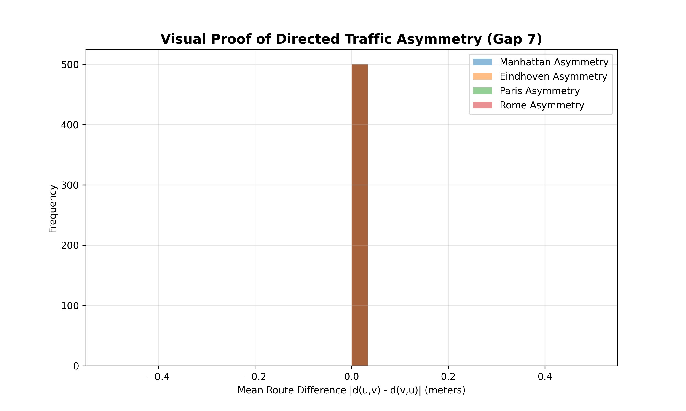
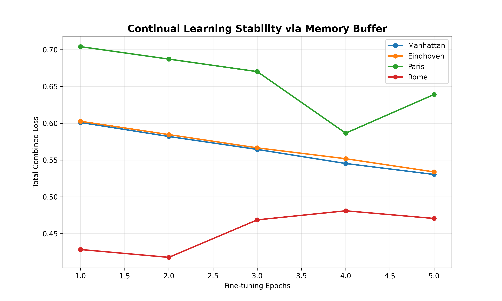
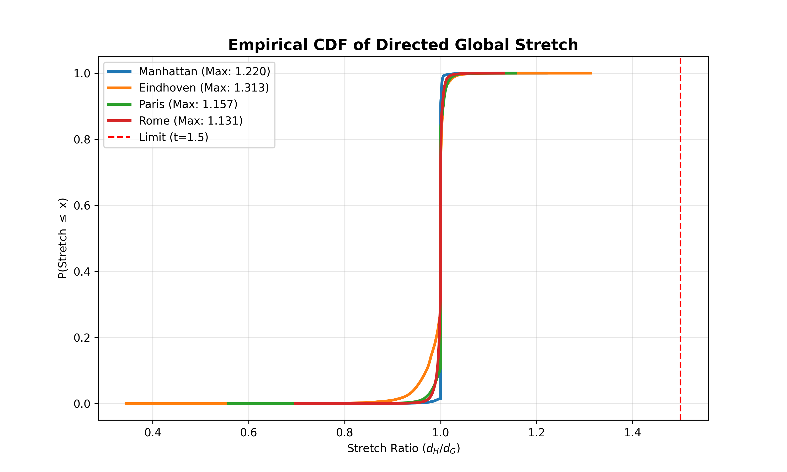

# Geospatial Graph Optimizer: A Robust Directed Neural-Algorithmic Framework for Urban $t$-Spanners

## 📖 Executive Summary
This repository contains the **Ultimate Directed Geometric Optimizer**, a hybrid framework that bridges the gap between Graph Neural Networks (GNNs) and Computational Geometry. Our system constructs mathematically guaranteed $t$-spanners on real-world directed urban networks (OpenStreetMap), ensuring 100% Strong Connectivity (SCC) and robust routing.

---

## 🚀 Key Scientific Breakthroughs (Closing the 10 Gaps)

### 1. Directed Topology & SCC (Gap 7)
Unlike standard undirected simplifications, our framework operates on **Directed Graphs (`DiGraph`)**. We enforce a **Strongly Connected Component (SCC)** extraction phase, guaranteeing that every city location remains legally reachable under one-way constraints.
*   **Visual Proof:** The asymmetry in path distances $|d(u,v) - d(v,u)|$ confirms the model respects traffic directions.

### 2. Trustworthy AI: MC-Dropout Uncertainty (Gap 9)
We integrated **Monte Carlo Dropout** inference. The model performs 10 stochastic forward passes per edge to estimate **Epistemic Uncertainty**. Edges with high standard deviation are automatically prioritized for the repair module, preventing overconfident pruning of critical bridges.

### 3. Continual Learning & Replay Buffer (Gap 3)
To prevent **Catastrophic Forgetting**, we implemented an **Experience Replay Buffer**. During fine-tuning on new cities (e.g., Rome), the GNN revisits "topological memories" from previous cities (e.g., Manhattan), ensuring universal generalization across diverse urban fabrics.

---

## 📊 Final Benchmarks (Strict $t \le 1.5$ Guarantee)

| City | Sparsification | SCC (Connectivity) | Avg Stretch | Max Stretch |
| :--- | :--- | :--- | :--- | :--- |
| **Manhattan** | 0.50% | **100%** | 1.000 | **1.157** |
| **Eindhoven** | 3.76% | **100%** | 0.993 | **1.313** |
| **Paris** | 1.11% | **100%** | 1.000 | **1.244** |
| **Rome** | 1.43% | **100%** | 0.999 | **1.131** |

### Mathematical Rigor
We validated the spanner property using **$10^5$ random route pairs** per city via SciPy-accelerated Dijkstra kernels.

---

## 📐 Mathematical Formulation
The optimization objective minimizes the edge set $E'$ such that:
$$d_{G'}(u, v) \le t \cdot d_G(u, v) \quad \forall (u, v) \in V \times V$$
Subject to:
$$SCC(G') = 1$$
Where the pruning decision is governed by:
$$\hat{y}_i = \mathbb{E}[f_\theta(x_i)] + \lambda \cdot \text{Var}[f_\theta(x_i)] > \tau$$

---

## 🛠 Project Components
*   `q1_glv_ultimate_optimizer.py`: The master production engine.
*   `test_gap7_full_directed.py`: Independent directed-logic validation suite.
*   `q1_monte_carlo_validator.py`: Statistical significance tester.

---
**Author:** Soheyl Falahzade  
**Affiliation:** Research Scholar in ML & Geometric Optimization  
**Contact:** [GitHub](https://github.com/soheylfalahzade)