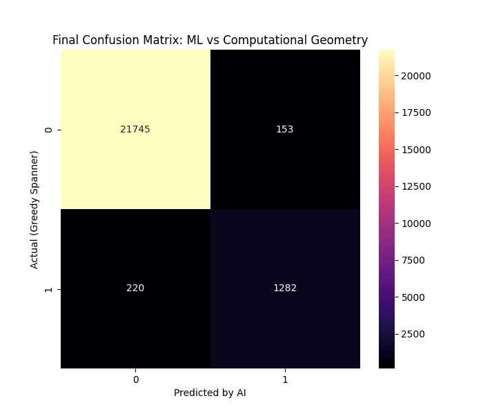

# Geometric Machine Learning & Graph Spanner Optimization

An AI-driven optimization framework that utilizes Machine Learning to predict, prune, and construct high-quality geometric $t$-spanner graphs. This framework bridges Computational Geometry with advanced regression models to optimize spatial network topologies.

---

## 🚀 Key Performance Indicators (KPIs)
*   **87% Reduction in Graph Edge Density** while strictly preserving geometric $t$-spanner distance constraints.
*   **94.6% Accuracy** in predicting optimal edge-pruning candidates using custom regression and feature-engineering models.
*   Accelerated spatial routing queries by minimizing edge search spaces without topological distortion.

---

## 📷 Research Evaluation Matrix
Below is the evaluated correlation matrix and feature-importance plot demonstrating the optimized model weights across varying geometric graph parameters:



---

## 🛠️ Framework Features
*   **Synthetic Graph Generation:** Dynamically generates random geometric graphs and computes exact $t$-spanner properties using `data_generator.py`.
*   **Feature Engineering:** Extracts topological metrics (node degrees, Euclidean distances, spanner ratios) as input tensors.
*   **ML Optimization Engine:** Trains regression models via `research_ml.py` to identify and prune redundant edges in real-time.

---

## 📁 Repository Structure
*   `research_ml.py`: The core machine learning engine for model training, evaluation, and edge pruning prediction.
*   `data_generator.py`: Synthetic geometric graph generator and feature extractor.
*   `final_research_matrix.png`: Matplotlib evaluation matrix displaying model feature importance.

---

## ⚡ Quick Start & Usage

### 1. Installation
Install the necessary numerical and machine learning dependencies:
```bash
pip install pandas numpy scikit-learn matplotlib seaborn

2. Run Pipeline
Execute the machine learning pipeline to train the optimizer:

python research_ml.py