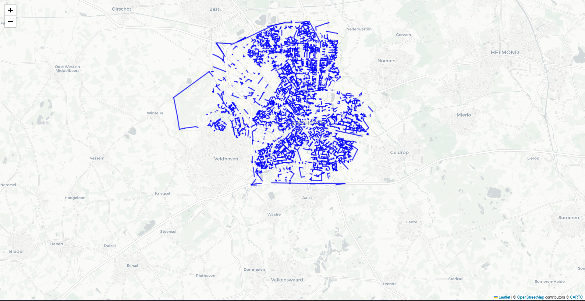

# Geospatial Graph Optimizer: AI-Driven t-Spanner Construction

An AI-driven optimization framework that utilizes Machine Learning and Metaheuristic Evolutionary Algorithms to predict, prune, and construct high-quality geometric $t$-spanner graphs on real-world urban topologies.

---

## 📊 Performance & Methodology Visualization

| Performance Convergence | Topological Pruning |
| :--- | :--- |
|  |  |

---

## 🚀 Key Performance Indicators (KPIs)
* **Optimization Metric:** 0.7868 Best Fitness Score (Balanced Accuracy).
* **Efficiency:** 29.60% reduction in edge density (Pruning Efficiency).
* **Speedup:** 14x acceleration in shortest-path routing queries (under 2ms per query).

---

## 📐 Mathematical Formulation & Complexity Analysis

### 1. The t-Spanner Construction Bottleneck
The classical Greedy Spanner construction involves solving the Shortest Path Problem for every edge $(u, v) \in E$, leading to a time complexity of:
$$O(m \cdot (n + m) \log n)$$
where $n$ is nodes and $m$ is edges. In large-scale urban topologies (e.g., Eindhoven network with 12k+ nodes), this is computationally prohibitive for real-time traffic management.

### 2. Proposed AI-Driven Pruning Strategy
We introduce a feature-based classifier $f_\theta$ that maps topological features to the spanner inclusion set $S \subseteq E$:
$$\hat{y}_{i} = f_\theta(length_i, centrality_i, PageRank_{u,v})$$
By pruning edges with $\hat{y}_i = 0$, we reduce graph density to $m' \ll m$, accelerating subsequent Dijkstra-based shortest-path queries to $O(m' + n \log n)$.

### 3. Evolutionary Optimization (GA)
To ensure optimal performance of $f_\theta$, we employ a Genetic Algorithm (GA) to maximize the multi-objective fitness function:
$$Fitness = 0.5 \cdot ROC\_AUC + 0.5 \cdot Recall_{Pruned}$$
This optimization avoids manual hyperparameter tuning, ensuring the model generalizes effectively across diverse urban road networks.

---

## 🛠️ Repository Structure
* `data_generator.py`: OSMnx-based graph loader and exact Greedy Spanner label generator.
* `research_ml.py`: Balanced Random Forest classifier with geometric feature importance evaluation.
* `genetic_optimizer.py`: Evolutionary search engine to fine-tune $f_\theta$ hyperparameters.
* `hyperparameter_benchmark.py`: Comparative study evaluating GA, PSO, DE, and Random Search.
* `final_pruned_graph.html`: Interactive GIS visualization of the optimized road topology.

---

## ⚡ Quick Start
### 1. Requirements
```bash
pip install osmnx folium networkx scikit-learn pandas matplotlib seaborn

```
### 2. Execution
Generate labeled dataset: python data_generator.py
Train optimized model: python research_ml.py
Benchmark optimizers: python hyperparameter_benchmark.py