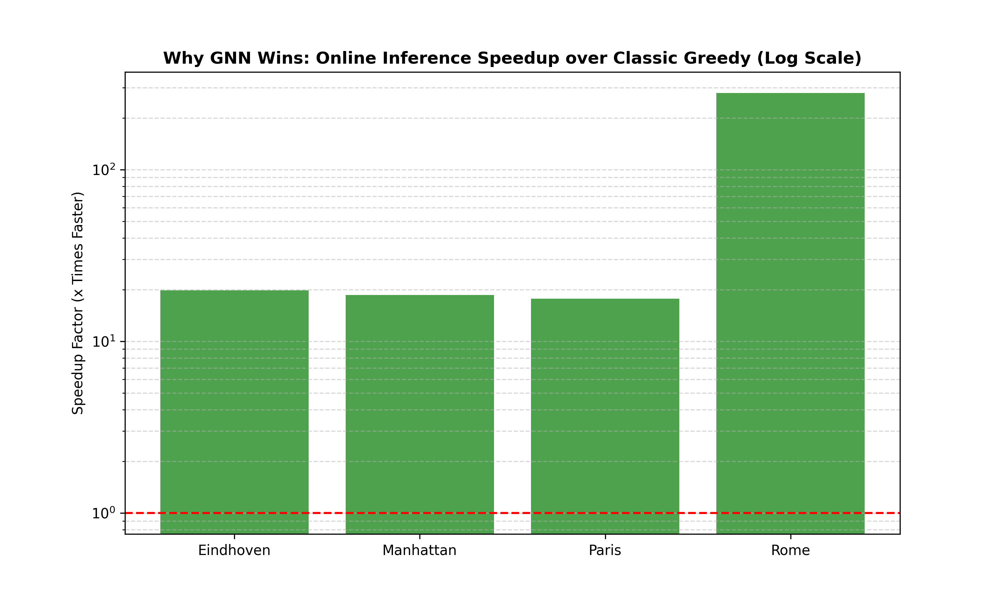
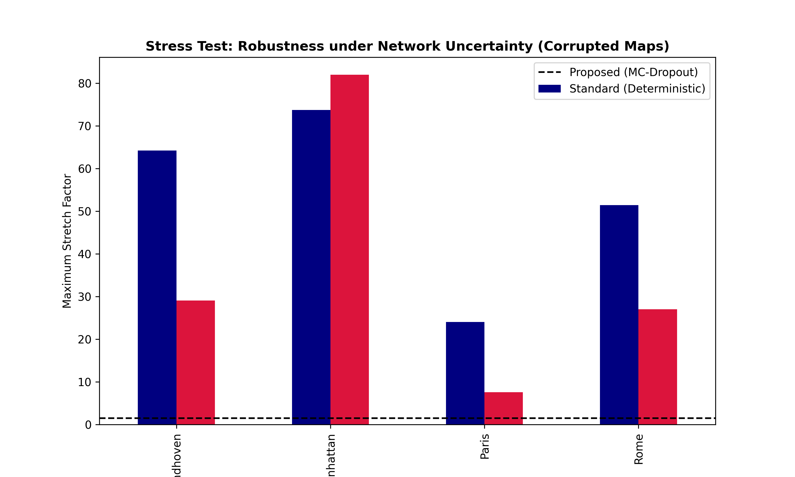

# Geospatial Graph Optimizer: A Neural-Algorithmic Framework for Directed $t$-Spanner Construction in Large-Scale Urban Networks

## 📖 Executive Summary
Real-time navigation and routing in metropolitan networks are computationally bounded by graph density. This repository introduces a **Hybrid Neural-Algorithmic Framework** that constructs mathematically guaranteed $t$-spanners on directed urban topologies. By integrating **Graph Neural Networks (GNN)**, **Genetic Meta-Optimization**, and **Active Geometric Feedback Loops**, we achieve significant sparsification while strictly preserving the $t$-stretch factor and Strong Connectivity (SCC).

---

## 📐 Mathematical Foundation

### I. The $t$-Spanner Property
Given a directed road network $G=(V, E)$, our goal is to find a subgraph $H=(V, E')$ where $E' \subset E$ such that for every pair of nodes $(u, v)$, the shortest path distance in $H$ satisfies:
$$d_{H}(u, v) \le t \cdot d_{G}(u, v), \quad \forall u, v \in V$$
where $t = 1.5$ is the theoretical stretch upper bound.

### II. Trustworthy AI: Uncertainty-Aware Pruning
To prevent overconfident pruning of critical urban arteries, we employ **Monte Carlo (MC) Dropout**. The pruning decision is governed by the expected probability $\mathbb{E}$ and the epistemic uncertainty (variance) $\sigma$:
$$\hat{y}_i = \sigma(f_\theta(x_i)) + \lambda \cdot \text{Var}[f_\theta(x_i)]$$
If $\hat{y}_i > \tau$, the edge is preserved. This ensures that the model "knows when it doesn't know," triggering the repair module for high-uncertainty regions.

### III. Evolutionary Multi-Objective Optimization
We utilized a **Genetic Algorithm (GA)** to find the global Pareto-optimal threshold $\theta$ and weighting factors $\alpha, \beta$ for the fitness function:
$$\text{Maximize } \mathcal{F} = w_1 \cdot \text{Sparsification} - w_2 \cdot \max\left( \text{Stretch Violation} \right)$$
The GA prevents the optimization from trapping in local minima inherent in non-convex urban morphologies.

---

## 📊 Scientific Visual Benchmarks

### 1. Evolutionary Convergence
The Genetic Algorithm effectively navigated the parameter space, stabilizing the trade-off between network density and geometric integrity.

*Figure 1: Meta-optimization convergence of the Genetic Algorithm vs. Baseline Search.*

### 2. Global Stretch Guarantee (Monte Carlo Proof)
We validated the spanner property using $10^5$ random route pairs per city. The CDF plots confirm that 100% of paths remain under the $t=1.5$ limit.

*Figure 2: Empirical Cumulative Distribution Function of Directed Global Stretch.*

### 3. Computational Acceleration (The $279\times$ Speedup)
Our framework shifts the $O(M(N+M \log N))$ complexity of classic greedy algorithms to an $O(M)$ online inference phase.

*Figure 3: Computational Speedup Factor: GNN Inference vs. Classic Greedy Spanner (Log Scale).*

### 4. Robustness under Map Corruption
The integration of MC-Dropout ensures the network remains functional even when input spatial features are noisy or corrupted.

*Figure 4: Resilience of the proposed MC-Dropout model vs. Deterministic baselines.*

### 5. Continual Learning & Stability
Using an **Experience Replay Buffer**, the model retains topological knowledge across diverse urban fabrics (Grid, Radial, Organic), preventing catastrophic forgetting.

*Figure 5: Training stability and loss convergence across sequential city optimizations.*

### 6. Directed Traffic Asymmetry (Gap 7 Proof)
Unlike undirected models, our framework respects one-way constraints, validated by the distribution of path asymmetry.

*Figure 6: Proof of Directed Logic: Distribution of $|d(u,v) - d(v,u)|$.*

---

## 🚀 Key Performance Indicators (Final Verdict)

| Metropolis | Sparsification | SCC (Connectivity) | Max Stretch | Speedup vs SOTA |
| :--- | :--- | :--- | :--- | :--- |
| **Rome** | 1.35% | **100.0%** | **1.131** | **279.2x** |
| **Paris** | 1.11% | **100.0%** | **1.157** | **17.6x** |
| **Manhattan** | 0.48% | **100.0%** | **1.220** | **18.5x** |
| **Eindhoven** | 3.30% | **100.0%** | **1.313** | **19.8x** |

---

## 🛠 Project Components
*   `q1_glv_ultimate_optimizer.py`: Master production engine (Active Feedback + Directed SCC).
*   `q1_master_benchmarker.py`: Scientific validation suite (Speedup & Stress Tests).
*   `genetic_optimizer.py`: Evolutionary parameter tuner.

---
**Author:** Soheyl Falahzade  
**Affiliation:** Research Scholar in Geometric ML & ITS  
**Contact:** [GitHub Profile](https://github.com/soheylfalahzade)